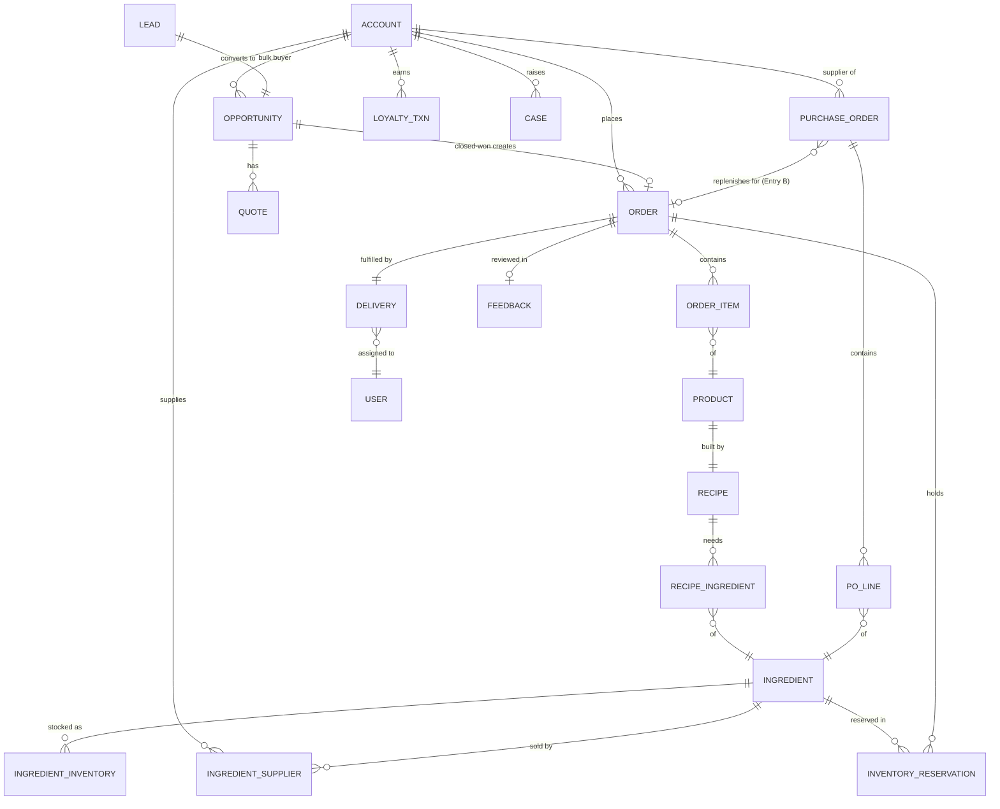

# Bakeroo Cloud Kitchen — Salesforce Data Model (V1)

This is the object list, field-level detail, and relationship map for the three flows we designed (same-day B2C, bulk B2B, and ingredient replenishment). It reuses standard objects where Salesforce already gives you the machinery for free, and adds custom objects only where the kitchen/recipe/procurement domain has no standard equivalent.

---

## 1. Orientation — which cloud owns what

| Domain | Cloud | Core objects |
|---|---|---|
| Storefront, cart, checkout | Commerce (D2C) + Experience Cloud | WebStore, WebCart, CartItem, Product2, Pricebook |
| Customers & loyalty | Sales / core | Account (Person), Contact, Loyalty Point Transaction |
| Bulk pipeline | Sales Cloud | Lead, Opportunity, Quote, Order |
| Kitchen, recipes, inventory | Custom | Recipe, Ingredient, Recipe Ingredient, Ingredient Inventory, Inventory Reservation |
| Procurement | Custom | Purchase Order, Purchase Order Line, Ingredient Supplier |
| Fulfillment | Custom | Delivery |
| Support | Service Cloud | Case |

### Record-type strategy (decide this first — it shapes everything)

- **Account** uses three record types:
  - **Customer** → *Person Account* (individual B2C consumers; loyalty lives here)
  - **Bulk Buyer** → *Business Account* (corporate/event buyers from the bulk pipeline)
  - **Supplier** → *Business Account* (ingredient vendors)
- **Order** uses two record types: **Same-Day (B2C)** and **Bulk Scheduled (B2B)**.

> **Person Accounts are a one-way door** — once enabled in an org they can't be turned off. Given loyalty + individual consumers are core to V1, they're the right model, but flag it as a conscious decision.

---

## 2. Object inventory

### Standard objects (reused)

| Object | API Name | Role in Bakeroo |
|---|---|---|
| Account | `Account` | Customers (Person), Bulk Buyers, Suppliers — via record types |
| Contact | `Contact` | Bulk-buyer contacts, supplier contacts (Person Accounts auto-create one) |
| Lead | `Lead` | First-time bulk enquiry capture |
| Opportunity | `Opportunity` | A bulk deal in negotiation |
| Quote | `Quote` / `QuoteLineItem` | Negotiated bulk pricing artifact sent to buyer |
| Product2 | `Product2` | Sellable **menu item** (the thing a customer buys) |
| Pricebook | `Pricebook2` / `PricebookEntry` | Menu pricing |
| Order | `Order` / `OrderItem` | Confirmed **customer** order (both same-day and bulk) |
| Cart | `WebCart` / `CartItem` | Commerce cart (managed by Commerce Cloud) |
| Case | `Case` | Support requests (SE / AI agent) |

### Custom objects (new)

| Object | API Name | Role in Bakeroo |
|---|---|---|
| Recipe | `Recipe__c` | The build-of-materials for one menu item |
| Ingredient | `Ingredient__c` | Raw material master (flour, sugar, …) |
| Recipe Ingredient | `Recipe_Ingredient__c` | **Junction:** how much of each ingredient a recipe needs |
| Ingredient Inventory | `Ingredient_Inventory__c` | Stock level record(s) per ingredient |
| Inventory Reservation | `Inventory_Reservation__c` | Soft (same-day) + forward (bulk) holds on stock |
| Ingredient Supplier | `Ingredient_Supplier__c` | **Junction:** which suppliers sell an ingredient, at what price/lead time |
| Purchase Order | `Purchase_Order__c` | Replenishment order to a supplier |
| Purchase Order Line | `Purchase_Order_Line__c` | Ingredient line items on a PO |
| Delivery | `Delivery__c` | Fulfillment record linking order → agent |
| Feedback | `Feedback__c` | Post-delivery review/rating |
| Loyalty Point Transaction | `Loyalty_Point_Transaction__c` | Earn/redeem ledger; balance rolls up to Account |

> **Delivery Agent** is modelled as a **User** (internal, licensed) referenced by lookup on Delivery. If your drivers won't be licensed Salesforce users, swap this for a lightweight `Delivery_Agent__c` custom object — noted again in §5.

---

## 3. Field detail by object

Only meaningful fields are listed — standard system fields (Id, Name, CreatedDate, Owner) are assumed.

### Account (Customer / Bulk Buyer / Supplier)
| Field | Type | Notes |
|---|---|---|
| Record Type | Record Type | Customer / Bulk Buyer / Supplier |
| Loyalty Points Balance | Roll-Up Summary (or Number) | Sum of Loyalty Point Transactions; Customer only |
| Default Delivery Address | Address / compound | Customer only |
| Payment Terms | Picklist | Supplier only (Net 15/30…) |
| Default Lead Time (days) | Number | Supplier only — fallback if not set per ingredient |
| Active Supplier | Checkbox | Supplier only |

### Lead
| Field | Type | Notes |
|---|---|---|
| Estimated Quantity | Number | Bulk size indicated by buyer |
| Requested Delivery Date | Date | **The anchor** for the whole feasibility check |
| Items of Interest | Long Text / related | Which menu items |
| Bulk Source | Picklist | "Bulk button" vs "Threshold trip" |

### Opportunity
| Field | Type | Notes |
|---|---|---|
| Requested Delivery Date | Date | Carried from Lead |
| Feasibility Status | Picklist | Feasible / Shortfall-replenishable / Not-feasible |
| Deposit Amount | Currency | |
| Deposit Paid | Checkbox | Gates the commit point |
| Total Quantity | Number | Drives capacity + ingredient projection |

### Order (+ OrderItem)
| Field | Type | Notes |
|---|---|---|
| Record Type | Record Type | Same-Day / Bulk Scheduled |
| Order Type | Picklist | B2C / B2B (redundant with RT but handy in reports) |
| Scheduled Delivery Date | Date/Time | Same as today for same-day; future for bulk |
| Same-Day Flag | Checkbox | |
| Kitchen Status | Picklist | Queued / Preparing / Prepared |
| Payment Status | Picklist | Pending / Paid / COD / Refunded |
| Source Opportunity | Lookup(Opportunity) | Bulk orders only |
| Delivery Address | Address | Auto-filled from Account/Contact |
| **OrderItem** → Product | Lookup(Product2) | via PricebookEntry |
| **OrderItem** Quantity | Number | Scales recipe consumption |

### Product2
| Field | Type | Notes |
|---|---|---|
| Category | Picklist | Cakes / Breads / … |
| Prep Time (min) | Number | Feeds same-day feasibility |
| Is Available | Checkbox | |
| Recipe | (via `Recipe__c.Product__c`) | 1 product → 1 recipe |

### Recipe (`Recipe__c`)
| Field | Type | Notes |
|---|---|---|
| Product | Lookup(Product2) | Which menu item this produces |
| Yield | Number | Units produced per batch |
| Active | Checkbox | Supports future recipe versioning |

### Ingredient (`Ingredient__c`)
| Field | Type | Notes |
|---|---|---|
| Unit of Measure | Picklist | g / kg / ml / each … |
| Reorder Threshold | Number | Reactive trigger point (Flow 3, Entry A) |
| Safety Stock | Number | Buffer baked into reorder logic |
| Is Perishable | Checkbox | Flags V2 shelf-life handling |
| Preferred Supplier | Lookup(Account) | Convenience default; authoritative source is the junction |

### Recipe Ingredient (`Recipe_Ingredient__c`) — junction
| Field | Type | Notes |
|---|---|---|
| Recipe | Master-Detail(Recipe) | |
| Ingredient | Lookup(Ingredient) | |
| Quantity Required | Number | Per recipe yield |
| Unit | Picklist | Matches ingredient UoM |

### Ingredient Inventory (`Ingredient_Inventory__c`)
| Field | Type | Notes |
|---|---|---|
| Ingredient | Master-Detail(Ingredient) | |
| Quantity On Hand | Number | Physical stock |
| Quantity Reserved | Roll-Up / Number | Sum of active reservations |
| Quantity Available | Formula | On Hand − Reserved |
| Batch / Expiry | Text / Date | V2 (FIFO), one inventory record per batch |

### Inventory Reservation (`Inventory_Reservation__c`)
| Field | Type | Notes |
|---|---|---|
| Ingredient | Lookup(Ingredient) | |
| Order | Master-Detail(Order) | Release when order cancelled |
| Quantity | Number | |
| Reservation Type | Picklist | Soft (same-day) / Forward (bulk) |
| Needed-By Date | Date | = delivery date for forward holds |
| Status | Picklist | Active / Finalized / Released |

### Ingredient Supplier (`Ingredient_Supplier__c`) — junction
| Field | Type | Notes |
|---|---|---|
| Ingredient | Master-Detail(Ingredient) | |
| Supplier | Lookup(Account, Supplier RT) | |
| Unit Price | Currency | |
| Lead Time (days) | Number | Drives "can we replenish in time?" |
| Is Preferred | Checkbox | Supplier selection when multiple exist |
| Min Order Qty | Number | |

### Purchase Order (`Purchase_Order__c`)
| Field | Type | Notes |
|---|---|---|
| Supplier | Lookup(Account, Supplier RT) | |
| Status | Picklist | Draft / Pending Approval / Sent / Received / Closed |
| Source | Picklist | Reactive (Entry A) / Forward (Entry B) |
| Linked Order | Lookup(Order) | Set only for Entry B (bulk shortfall) |
| Needed-By Date | Date | From the bulk order's delivery date |
| Expected Delivery Date | Date | Order date + lead time |
| Approval Status | Picklist | Auto / Approved / Rejected |
| Total | Roll-Up | Sum of line totals |

### Purchase Order Line (`Purchase_Order_Line__c`)
| Field | Type | Notes |
|---|---|---|
| Purchase Order | Master-Detail(Purchase Order) | |
| Ingredient | Lookup(Ingredient) | |
| Quantity Ordered | Number | |
| Quantity Received | Number | Supports partial deliveries |
| Unit Price | Currency | Snapshot from junction |
| Line Status | Picklist | Open / Partially Received / Received |

### Delivery (`Delivery__c`)
| Field | Type | Notes |
|---|---|---|
| Order | Master-Detail(Order) | |
| Delivery Agent | Lookup(User) | Auto-assigned by availability |
| Status | Picklist | Assigned / Out for delivery / Delivered / Failed |
| Scheduled Date | Date/Time | |
| Delivered At | Date/Time | |
| Delivery Address | Address | |

### Feedback (`Feedback__c`)
| Field | Type | Notes |
|---|---|---|
| Order | Lookup(Order) | |
| Customer | Lookup(Account) | |
| Rating | Number (1–5) | |
| Comments | Long Text | |

### Loyalty Point Transaction (`Loyalty_Point_Transaction__c`)
| Field | Type | Notes |
|---|---|---|
| Customer | Master-Detail(Account) | Enables roll-up balance |
| Order | Lookup(Order) | Earn source |
| Points | Number | +earn / −redeem |
| Type | Picklist | Earn / Redeem / Adjustment |

---

## 4. Relationship map

### Text form (parent → child, cardinality)

- **Account (Customer)** 1—* **Order** ; 1—* **Loyalty Point Transaction** ; 1—* **Case**
- **Account (Bulk Buyer)** 1—* **Opportunity** 1—* **Quote** ; Opportunity 1—1 **Order** (via *Source Opportunity*)
- **Account (Supplier)** 1—* **Purchase Order** ; 1—* **Ingredient Supplier**
- **Lead** →(convert)→ **Account + Contact + Opportunity**
- **Order** 1—* **OrderItem** *—1 **Product2**
- **Product2** 1—1 **Recipe** 1—* **Recipe Ingredient** *—1 **Ingredient**
- **Ingredient** 1—* **Ingredient Inventory** ; 1—* **Ingredient Supplier** ; 1—* **Inventory Reservation**
- **Order** 1—* **Inventory Reservation** (holds released on cancel)
- **Purchase Order** 1—* **Purchase Order Line** *—1 **Ingredient**
- **Purchase Order** *—1 **Order** (Entry B link, optional)
- **Order** 1—1 **Delivery** *—1 **User** (agent)
- **Order** 1—1 **Feedback**

### Mermaid ER diagram (text-based, per your no-images preference)

---

## 5. Key design decisions & things to lock down

1. **Customer Order vs Supplier PO are split, not shared.** Your notes floated reusing `Order`/`OrderItem` for supplier orders. I've split them: customer `Order` (Products, Deliveries, loyalty) and custom `Purchase_Order__c` (Ingredients, Suppliers, goods-receipt) have genuinely different lifecycles and fields. Sharing one object with record types would force awkward nullable fields on both sides. *The alternative — keeping everything on standard `Order` with record types — is laid out in full in **Appendix A** below.*

2. **Ingredient (master) vs Ingredient Inventory (stock).** Kept separate so V2 batch/expiry tracking = multiple inventory rows per ingredient without reworking the model. In V1 you can run one inventory record per ingredient.

3. **Reservations are a first-class object.** This is what makes the "soft reserve at checkout" (Flow 1) and "forward reserve on the delivery date" (Flow 2) both work, and what powers *Quantity Available* so you don't oversell. Without it, the feasibility projection has nothing to read.

4. **Ingredient Supplier junction is the source of truth for procurement**, not the convenience `Preferred Supplier` lookup on Ingredient. It carries the price + lead time the "can we replenish in time?" check depends on.

5. **Delivery Agent = User (lookup).** Cleanest if drivers are licensed. If not, swap to a `Delivery_Agent__c` object with an availability flag and lookup from Delivery.

6. **Loyalty as a ledger + rollup**, not a single balance field — gives you an auditable earn/redeem history and a self-maintaining balance on the Account.

---

*V2 hooks already accommodated by this model: batch/expiry (Ingredient Inventory rows), forecast-driven procurement (Purchase Order `Source` + `Linked Order`), and recurring bulk orders (Opportunity clone patterns).*

---

## Appendix A — Single-Object Order variant

This keeps **customer orders and supplier purchase orders on the same standard `Order` / `OrderItem`**, differentiated by record type, instead of splitting procurement out into `Purchase_Order__c` / `Purchase_Order_Line__c`. Pick this if you want native Order machinery (activation, pricebook totals, one reporting surface) applied uniformly and prefer a leaner custom-object count over semantic separation.

### What changes

**Order gains a third record type:**

| Record Type | AccountId points to | Direction |
|---|---|---|
| Same-Day (B2C) | Customer | sold to |
| Bulk Scheduled (B2B) | Bulk Buyer | sold to |
| **Purchase Order** | **Supplier** | **bought from** |

Note the semantic inversion: a standard Order normally represents something sold *to* its Account, but a Purchase Order record represents something bought *from* the Supplier. It works, but the "sold-to" meaning of `AccountId` is being bent — be disciplined about it.

**OrderItem has to carry ingredients — this is the crux.** `OrderItem` is bound to `Product2` through `PricebookEntry`, but ingredients are `Ingredient__c`. Two ways to resolve it:

- **Recommended — shadow Product2 records.** Give every ingredient a matching `Product2` (Product Family = "Raw Material") with a `PricebookEntry` in a dedicated **Supplier/Procurement pricebook**. `Ingredient__c` keeps the kitchen master data (reorder threshold, safety stock, UoM) and holds a 1:1 lookup to its shadow `Product2`. Now ingredient PO lines are real OrderItems with working price/total math, and the Order just needs its `Pricebook2Id` set to the procurement pricebook.
- **Alternative — custom Ingredient lookup on OrderItem.** Add an `Ingredient__c` lookup to `OrderItem` and skip the standard Product path for PO lines. Simpler data-wise, but you forfeit native pricebook/total behaviour on those lines and compute totals yourself.

### Objects & fields that move

- **Removed:** `Purchase_Order__c`, `Purchase_Order_Line__c`.
- **Relocated onto `Order`** (populated only when RT = Purchase Order): `Source` (Reactive / Forward), `Needed-By Date`, `Expected Delivery Date`, `Approval Status`.
- **Relocated onto `OrderItem`** (PO lines only): `Quantity Received`, `Line Status`.
- **Entry-B link becomes a self-lookup** on Order: `Replenishes_For__c` → the bulk customer `Order` this PO covers (replaces `Purchase_Order__c.Linked_Order__c`).

### Relationship deltas

| Split model (main) | Single-object model (this appendix) |
|---|---|
| `Purchase_Order__c` → Supplier (lookup) | `Order` (RT = PO) → Supplier via `AccountId` |
| `Purchase_Order_Line__c` → PO (master-detail) | `OrderItem` → Order (standard) |
| `Purchase_Order_Line__c` → Ingredient (lookup) | `OrderItem` → shadow `Product2` → `Ingredient__c` |
| `Purchase_Order__c.Linked_Order__c` → Order | `Order.Replenishes_For__c` → Order (self-lookup) |
| Delivery / Feedback / Loyalty / Reservation → Order | unchanged — **but every one must exclude the PO record type** |

### Trade-offs

**Gains**
- One object and one automation surface; native Order activation, pricebook totals and reporting apply to POs for free.
- Fewer custom objects to build and maintain.
- A single "all orders" reporting surface across sales and procurement.

**Costs**
- Ingredients exist twice — as `Ingredient__c` *and* a shadow `Product2` — unless you accept non-standard PO lines.
- Customer-only fields sit empty on PO records and PO-only fields sit empty on customer orders: more nullable fields and record-type-driven page layouts.
- **Every downstream automation must guard against the Purchase Order record type** — Delivery creation, loyalty accrual, feedback request, inventory reservation and same-day feasibility should all skip PO records, or they'll fire on supplier orders.
- Standard Order's sold-to semantics are inverted for the supplier direction — fine with discipline, confusing without it.

### When to pick which

- **Split (main model):** each object means one thing, no shadow products, cleaner as procurement grows (multi-supplier bidding, receiving workflows, three-way match). Default recommendation.
- **Single-object (this appendix):** leanest object count and maximal reuse of native Order features. Best for a tight V1 where procurement stays simple and one reporting surface matters more than semantic purity.
