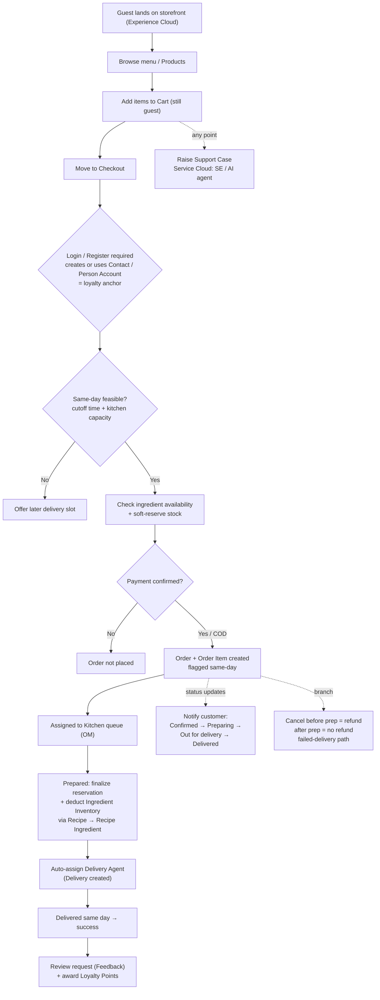
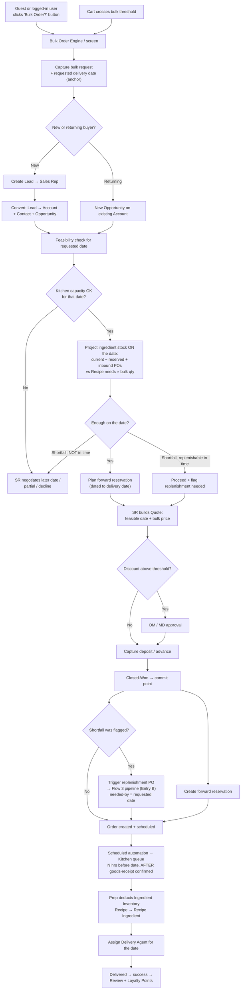
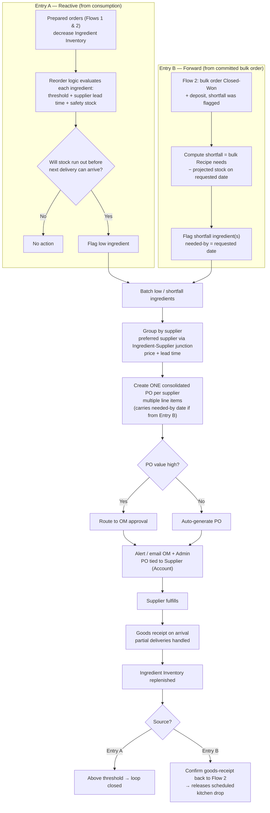

# Bakeroo Cloud Kitchen — Process Flows (V1)

Three end-to-end flows for the Bakeroo build, with written steps and matching Mermaid diagrams. Paste any diagram into mermaid.live, Notion, or an IDE Mermaid preview to render — they stay editable as text.

- **Flow 1** — Small order, same-day delivery (B2C, Commerce Cloud)
- **Flow 2** — Bulk order for a later date (B2B, Sales Cloud) — includes the ingredient-feasibility branch
- **Flow 3** — Ingredient replenishment from suppliers (procurement) — two entry points

These reflect the split-object data model (customer `Order` separate from supplier `Purchase_Order__c`).

---

## Flow 1 — Small order, same-day delivery (B2C, Commerce Cloud)

Pure Commerce Cloud path. Never crosses the bulk threshold, so it never touches the Sales pipeline.

1. Customer lands on the Experience Cloud storefront **as a guest** and browses the menu (Products / store items).
2. Adds items to **Cart** — still a guest (Cart, Cart Item).
3. Moves from cart → checkout → **Login / Register required here** (creates/uses Contact or Person Account — this is the loyalty anchor).
4. **Same-day feasibility check:** validate against the delivery cutoff time and current kitchen capacity. If it fails, offer a later slot instead of accepting same-day.
5. **Inventory availability + soft reservation:** confirm the items' ingredients are in stock and reserve them so two customers can't grab the last portion.
6. **Payment** — order does not proceed until payment is confirmed (or COD is explicitly allowed).
7. **Order created** (Order + Order Item), flagged same-day.
8. Order **assigned to the Kitchen** queue (Operations Manager owns this).
9. As each item is prepared, the reservation is **finalized and Ingredient Inventory is deducted** — driven by the item's Recipe → Recipe Ingredient junction.
10. Order **auto-assigned to a Delivery Agent** by availability (round-robin / simple rule); delivery address auto-populates (Delivery record created).
11. **Customer notifications** fire at each stage: confirmed → preparing → out for delivery → delivered.
12. Delivery completed same day → order/delivery marked successful.
13. System **requests a review** (Feedback) and awards **Loyalty Points**.

**Branches:** cancellation / failed delivery / refund — cancel before prep = auto refund; after prep = no refund; failed delivery (customer not home) handled as its own path.
**Parallel:** from any point, the customer can **raise a Support Case** (Service Cloud) handled by the Support Executive or AI agent.
**V2:** guest checkout, forecast-driven reservation.

---

## Flow 2 — Bulk order for a later date (B2B, Sales Cloud)

Two ways in — the deliberate "Bulk Order?" choice or the automatic threshold trip. Either way it lands in the Sales pipeline instead of self-service checkout. This version folds in the **ingredient-feasibility check** that projects stock to the requested date and hands any shortfall to Flow 3.

**Entry points**
- **Explicit:** a guest or logged-in user clicks the **"Bulk Order?" button/link** → redirected straight to the Bulk Order screen (no cart needed).
- **Automatic:** a user's cart quantity **crosses the bulk threshold** → routed to the same Bulk Order Engine.

**Steps**
1. Bulk request captured, **including the requested delivery date** (the anchor the feasibility check runs against). Guest enters details; logged-in buyer's info pre-fills.
2. **New vs. returning buyer routing:**
   - **New buyer** → create a **Lead** → route to a **Sales Rep (SR)** → SR qualifies and **converts Lead → Account + Contact + Opportunity**.
   - **Returning buyer (known Account/Contact)** → skip the Lead, create a **new Opportunity** on the existing Account.
3. **Feasibility check for the requested date:**
   - **Kitchen capacity** for that date — if it can't produce the volume, SR negotiates a later date / partial order / decline.
   - **Ingredient projection on the date:** `current stock − already-reserved + inbound POs arriving before the date` vs `Recipe needs × bulk quantity`. Three outcomes:
     - **Enough** → plan a **forward reservation** dated to the delivery date.
     - **Shortfall, replenishable in time** (supplier lead time fits) → proceed and **flag a replenishment PO**.
     - **Shortfall, not in time** → can't hit the date → negotiate / decline.
4. SR builds a **Quote** with a feasible date + negotiated bulk pricing. *(The projection runs here so the quoted date is one you can actually hit — no PO placed yet.)*
5. **Discount approval:** discounts above a set threshold route to **OM/MD approval**; below it, auto-approved.
6. **Deposit / advance payment** captured on the Quote/Opportunity.
7. Opportunity **Closed-Won = the commit point.** Create the **forward reservation**; if a shortfall was flagged, **trigger the replenishment PO into Flow 3 (Entry B)** with needed-by = requested date. *(Real money is only spent on ingredients now, de-risked by the deposit.)*
8. **Order created and scheduled** for the future date (not sent to the kitchen yet).
9. A **scheduled automation** flips the order into the **Kitchen** queue N hours before the date — **gated on goods-receipt confirmation** of any Entry-B PO.
10. Preparation deducts stock → **Ingredient Inventory decreases** (Recipe → Recipe Ingredient), same mechanism as Flow 1, larger volume.
11. **Assigned to a Delivery Agent** for the scheduled date.
12. Delivered → marked successful → **review request** (Feedback) + **Loyalty Points**.

**V2:** recurring / contract bulk orders (weekly standing orders).

---

## Flow 3 — Ingredient replenishment from suppliers (procurement)

Two entry points converge on one procurement pipeline. **Entry A** is reactive (consumption pushes an ingredient below threshold). **Entry B** is forward-looking (a committed bulk order in Flow 2 needs stock that isn't there yet).

**Steps**
1. Every prepared order **decreases Ingredient Inventory** via Recipe consumption (Flows 1 & 2) — this feeds **Entry A**.
2. **Entry A — reorder logic** evaluates each ingredient against its threshold, accounting for **supplier lead time + safety stock**, so it reorders when stock will run out *before the next delivery can arrive*, not just on a flat number.
3. **Entry B — forward shortfall** arrives from Flow 2: a Closed-Won bulk order (+ deposit) with a flagged shortfall, sized to `bulk needs − projected stock on the requested date`, carrying needed-by = requested date.
4. Flagged ingredients (from either entry) are **batched** rather than firing one PO at a time.
5. Batched ingredients are **grouped by supplier**, using a **preferred-supplier choice** where an ingredient has more than one option (via the Ingredient–Supplier junction carrying price + lead time).
6. **One consolidated Purchase Order per supplier** is created — multiple ingredient line items per PO, and it carries the needed-by date if it came from Entry B.
7. **Approval tiering:** small routine POs auto-generate; high-value POs route to **OM approval**.
8. **Alert / email** to the OM (and Admin) with the PO; PO is tied to a **Supplier** (Account, Supplier record type).
9. Supplier fulfills; **goods-receipt step** on arrival — inventory is replenished on *confirmed receipt* (partial deliveries handled), not on PO creation.
10. Inventory back above threshold → loop closed. **For an Entry-B PO, goods receipt also signals back to Flow 2** to release the gated "drop into kitchen" automation for that specific order.

**V2:** expiry / shelf-life / FIFO tracking for perishables; broader forecast-driven procurement.

---

## How the flows connect

- **Flows 1 & 2 both consume** ingredients at prep time → feed **Flow 3 Entry A**.
- **Flow 2 hands a forward shortfall** to **Flow 3 Entry B**; **Flow 3 hands a goods-receipt confirmation back** to Flow 2 to release the kitchen drop.
- **Both customer flows** end the same way: delivery success → Feedback + Loyalty Points, and can spin off a **Support Case** in parallel at any point.
